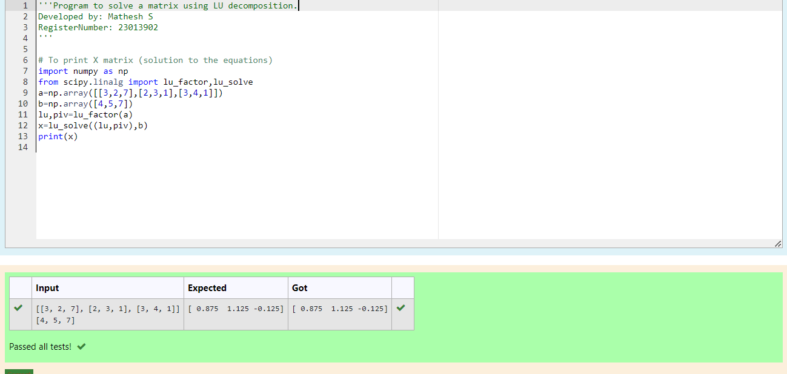

# LU Decomposition 

## AIM:
To write a program to find the LU Decomposition of a matrix.

## Equipments Required:
1. Hardware – PCs
2. Anaconda – Python 3.7 Installation / Moodle-Code Runner

## Algorithm
1. start the program
2. get an input from the uset 
3. display the value of L and U
4. stop the program

## Program:
(i) To find the L and U matrix
```
/*
Program to find the L and U matrix.
Developed by: Mathesh S
RegisterNumber: 23013902
*/
import numpy as np
from scipy.linalg import lu
a=np.array(eval(input()))
P,L,U=lu(a)
print(L)
print(U)
```
(ii) To find the LU Decomposition of a matrix
```
/*
Program to find the LU Decomposition of a matrix.
Developed by: Mathesh S
RegisterNumber: 23013902
*/
import numpy as np
from scipy.linalg import lu_factor,lu_solve
a=np.array([[3,2,7],[2,3,1],[3,4,1]])
b=np.array([4,5,7])
lu,piv=lu_factor(a)
x=lu_solve((lu,piv),b)
print(x)

```

## Output:





## Result:
Thus the program to find the LU Decomposition of a matrix is written and verified using python programming.

